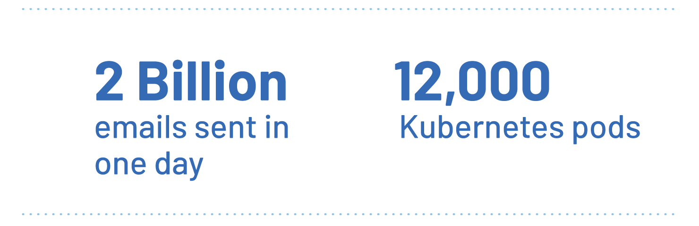
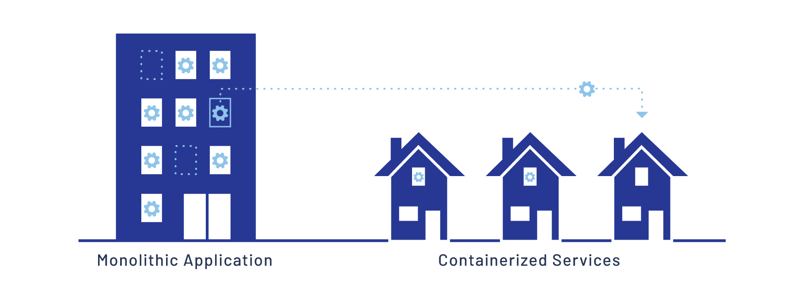

Bluecore は、多チャネルの個性化プラットフォームで、大規模な個性化電子メール、
ウェブメッセージングサービス、および有料メディア広告を提供することに専念しています。
Bluecore の独自の製品は、顧客の推奨データを処理し、大量の個性化されたデジタルコミュニケーションを送信する必要があるため、
大量のデータの取得、処理、送信を行う必要があります。この作業量は巨大です。
最近のブラックフライデーのセールでは、20 億通以上の電子メールを送信しました。

Bluecore は、速度も必要です。彼らは、ほとんどのパートナーとサービス契約を結んでおり、
顧客が作業を提出した後、数時間以内に電子メール、ウェブメッセージ、または広告を受信することを保証しています。
これは、処理速度が重要であることを意味します。
Google App Engine 上で実行される単体アプリケーションと、Google Kubernetes Engine (GKE) クラスター上で実行される約 12,

## 課題：単体アーキテクチャと増加するデータトラフィック {#the-challenge-monlithic-architecture-and-increasing-data-traffic}

Bluecore は、データ転送と処理に厳しい要件を持つ大規模な運用機関です。
彼らは、データ量が増加しているため、自分たちのアーキテクチャが更新されないと、必要なデータ量を処理できないという課題に直面しています。
彼らは、自分たちのアーキテクチャが更新されないと、必要なデータ量を処理できないという課題に直面しています。

彼らのアーキテクチャを検討した結果、単体アプリケーションが最大の課題であることがわかりました。
Bluecore の開発チームは、将来の成長を実現するために、
より柔軟で拡張性の高い基盤に移行する必要があると認識しました。

Kubernetes は、拡張性の高いパスを提供しています。
Bluecore は、すでに App Engine 上で実行されているため、
Kubernetes は、最適な選択肢です。
しかし、大多数 Bluecore のエンジニアは、コンテナ化されたアプリケーションの経験が不足しています。
これは、GKE への移行が困難になる可能性があります。

幸いなことに、彼らは解決策を見つけました。

## ソリューション：Istio サービスメッシュを使用して開発者を支援 {#the-solution-enabling-developers-with-the-istio-service-mesh}

“Istio を使用すると、すぐに構築を開始できます”，Bluecore のインフラストラクチャチームのソフトウェアエンジニア
Shray Kumar は、“そして、正しい方法で構築していることを確認できます。”

サービスメッシュがない場合、単体アプリケーションをコンテナ化されたサービスに分割すると、
明確な解決策がない多くの課題が発生します。
例えば、課題の 1 つは、認証と認可を実現する方法です。
コンテナ化されたサービスごとに独自のソリューションが必要な場合、
各開発者は、自分の方法で問題を解決する可能性が高くなります。
これは、コードの断片化と将来の多くの問題を引き起こす可能性があります。

幸いなことに、Kumar とインフラストラクチャチームは、Istio に精通しています。
彼らは、Bluecore のデータプラットフォームチームの最高責任者である Al Delucca と密接に連携し、
Istio の適用を開始する計画を立てました。

“この問題に遭遇しました”，Delucca は、“しかし、Istio がこの問題を解決する適切なツールかどうかは、私たちが明らかにする必要があります。”

彼らは、Istio の特性セットが多くの既存の課題の解決策を提供していることを発見しました。
認可は、その中の 1 つの特性です。
パートナーアプリケーションからの入力メッセージには、認証が必要です。
Istio は、このような認証をエッジで実行できます。
これは、各サービスが独自の方法を実装する必要がないことを意味します。

“私たちは、認証と認可をエッジに推進することができます。そうすることで、エンジニアはこれらのシステムの詳細を理解する必要がなくなります。”
Delucca は、“重要なのは、エンジニアが直接 Istio を使用したことではなく、Istio が彼らに何をしたかです。
これが重要です。これは、私たちにとって大きな勝利です。”

エンジニアが単体アプリケーションをサービスに分割するようになったとき、Istio が直面した課題の 1 つは、
サービスの呼び出しを追跡することでした。
多くの旧機能には、依存関係と要件に関する明確なドキュメントがありません。
これは、パフォーマンスの問題とリモートサービスの呼び出しにより、開発者が混乱する可能性があることを意味します。
幸いなことに、[Istio の分布式トレーシング](/zh/docs/tasks/observability/distributed-tracing/)がこの問題を解決します。
この機能を使用すると、開発者はボトルネックを見つけ、エラーを修正し、追加の作業を行う必要があるサービスを特定できます。

Istio のサービスメッシュにより、開発者は、基盤全体を深く理解することなく、単体アプリケーションをサービスに分割できます。
これにより、Bluecore のエンジニアは、より迅速に生産性を向上させることができます。

## 結論：未来 {#conclusion-the-future}

Bluecore チームは、Istio の特性の大きな価値を発見しましたが、まだ多くの特性を利用したいと考えています。
その 1 つは、[キャニスター](/zh/blog/2017/0.1-canary/)を管理できることです。
キャニスターは、アプリケーションの一部のトラフィックを使用して、新しいバージョンのサービスをテストできます。
テストが順調に進む場合、自動的に新しいバージョンをデプロイし、古いバージョンを段階的に削除できます。
一方、新しいバージョンに問題がある場合、古いバージョンに迅速にロールバックできます。

Bluecore チームは、単体アプリケーションをコンテナ化されたサービスに分割し、
Istio を利用して、より多くのサービスをエッジに推進し、開発者により多くの時間を自分の得意分野に費やすことができます。
彼らは、次の成長段階に備えて、データの取得と処理が増加することに自信を持っています。
