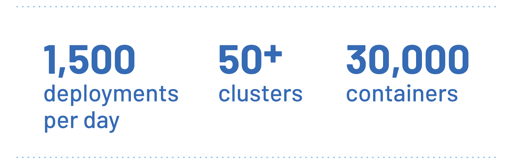
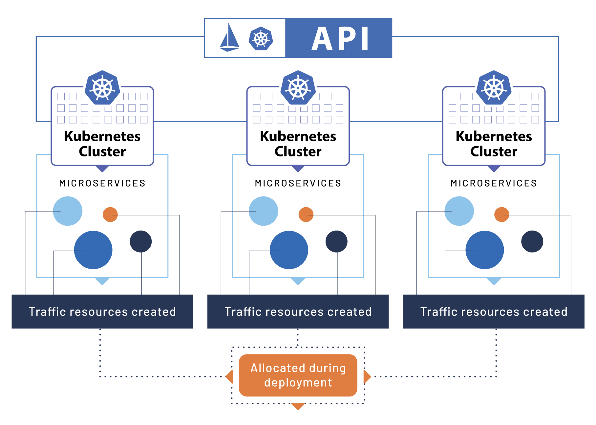

Rappi は、企業、消費者、および配達員をつなぎ、ユーザーがより多くの時間を節約できるようにすることを目指しています。
そのアプリケーションは、ユーザーがさまざまな商品やサービスを注文できるようにします。
これは、ラテンアメリカの最初のスーパーアプリケーションであり、
9 か国と 250 以上の都市にわたって展開しています。
2015 年に会社が設立されて以来、このアプリケーションは 1 億回以上のダウンロードを実現しました。

巨大な成功に伴い、急速な成長は課題をもたらしました。
Rappi は、成長を続けています。
過去数年間、会社の評価額は 1 億ドルから 80 億ドルに増加しました。
Rappi の技術チームは、業務の成長に追いつく必要がありました。
そのため、Rappi は、アプリケーションを Kubernetes 上にデプロイし、管理することを選択しました。
Kubernetes は、インフラストラクチャの成長を支援するツールとして徐々に普及しています。

然而，即使有了 Kubernetes，Rappi 的基础设施仍面临巨大的挑战。
例えば、50 以上の Kubernetes クラスターを効率的に管理する方法、
その中で最大のクラスターが 20,000 個以上のコンテナを実行している方法などです。

## 課題：成功に伴う課題 {#challenge-crush-of-success}

Rappi チームは、インフラストラクチャを Kubernetes に移行することに成功しましたが、
急速な成長はまだ多くの課題をもたらしました。
彼らは、技術型企業に変貌する必要がありました。
インフラストラクチャの管理を支援するために、彼らは内部のサービスメッシュを開発しました。
しかし、これは、維持管理が難しく、業務の成長速度に追いつくことができませんでした。

“Lyft が Envoy を使用している話を思い出したので、私は Envoy を自分の環境でテストすることにしました。”
Rappi の高級 DevOps エンジニア Ezequiel Arielli は言いました。

## ソリューション：Istio 力挽狂澜 {#istio-to-rescue}

Rappi チームは、Envoy Sidecar を使用した Istio のデプロイを決定しました。
結果は一拍即合でした。
Rappi チームが新プロジェクトのメッシュを構築するとき、
Istio ドキュメントが優れたサポートを提供していることがわかりました。
また、Istio API は、クリーンで効率的でした。
Istio は、Rappi のインフラストラクチャの管理に効果的なソリューションです。

最初の Istio デプロイが成功したメッセージが企業全体に広まるにつれ、
Rappi DevOps チームは、Istio を使用するようになりました。
当初は、30 人のチームが Istio を使用していましたが、
今日では、開発者が 1,500 人を超えています。

Istio は、Rappi DevOps チームに柔軟性を提供し、
異なるサービスに異なる規則を設定できるようにします。
彼らは、レート制限、断路器、接続プール、タイムアウト、およびその他の重要なパラメータをカスタマイズできます。

彼らは、Istio が安全とコンプライアンスに関して、非常に有益な機能を提供していることを発見しました。
例えば、サービスメッシュは、垂直トラフィックを分離し、
異なるエンドポイント間の通信を制限できます。

“Istio は、異なるサービスに異なる規則を設定できるため、非常に柔軟です。”
Rappi DevOps 技術主管 Juan Franco Cusa は言いました。
“また、安全とコンプライアンスに関して、非常に有益な機能を提供しています。
これは、安全に注意を払う環境にとって非常に便利です。”

“私たちの以前のソリューションが限界に達したとき、
Istio を使用して、独自の監視スタックを再構築することができました。”
Arielli は言いました。
“Istio は、チームがどの規模でも実行中のサービスを監視できるようにします。”

Rappi のインフラストラクチャが 30,000 個以上のコンテナを超えるにつれ、
この決定は重要になりました。

## 結果：インフラストラクチャが継続的に成長 {#outcome-infrastructure-continues-to-grow}

開発チームは、自動化された、本番環境就緒の Kubernetes と Istio クラスターのデプロイメントメカニズムを構築しました。
内部的 API は、Kubernetes クラスターの上にあり、
各クラスター内のマイクロサービスを簡単に管理できます。
さらに、デプロイメント中に、各マイクロサービスのトラフィックリソースが自動的に作成され、割り当てられます。
このシステムにより、開発チームは、1,500 回以上のデプロイメントを毎日管理できます。

“私たちの設定により、Kubernetes の使用量とインフラストラクチャが継続的に成長できます。”
Arielli は言いました。
“現在、50 個以上の Kubernetes クラスターを管理しており、
その中で最大のクラスターには、20,000 個以上のコンテナが含まれています。
私たちの環境は継続的に変化していますが、Istio は、すべてのコンテナ間で効率的で、拡張可能で、安全な通信を確保するのに役立っています。”

Istio は、1,500 個以上のアプリケーション間のトラフィックを管理しており、
その強力な機能セットにより、これらのクラスターは、必要に応じて異なるデプロイメント戦略を選択できます。
トラフィックが増加しても、Istio コントロールプレーンは、各接続を簡単に再バランスできます。

## Rappi の次のステップ {#what-is-next}

Istio を採用した DevOps チームは、インフラストラクチャの最適化を継続しています。

“将来、メッシュレベルでの複数クラスターのサポートを実現したいと考えています。”
Arielli は言いました。
“この機能により、アプリケーションが実行される場所は重要ではなくなります。
すべてのアプリケーションは、クラスター全体で相互にアクセスできるようになります。”

## 結論：Istio を使用して成功して拡大 {#conclustion-success-scaling-with-istio}

Istio サービスメッシュを使用することで、Rappi は、市場のニーズに合わせて、成功して拡大しました。
Rappi チームは、新しいクラスターをデプロイし、さらに多くの市場と都市でサービスを提供できます。

“Istio の支援により、Rappi が
Arielli は言いました。
