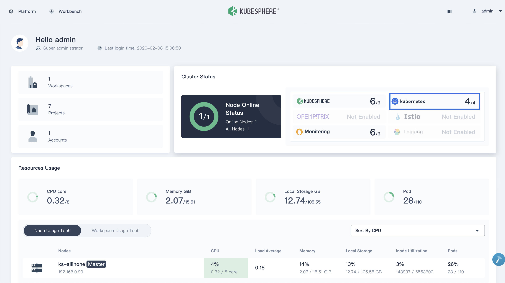

このドキュメントは 2021 年 3 月 9 日に最終更新されました。



以下の手順に従って [KubeSphere Container Platform](https://github.com/kubesphere/kubesphere) 環境を準備します。
KubeSphere を使うことで、Linux マシン上に素早く Kubernetes クラスタをインストールできます。


KubeSphere には [All-in-One](https://kubesphere.io/docs/installation/all-in-one/) と
[Multi-node](https://kubesphere.io/docs/installation/multi-node/) の 2 つのインストールモードがあります。
これにより、Kubernetes と Istio を統合された Web コンソールで素早くセットアップ・管理できます。
詳細は [Multi-node Installation](https://kubesphere.io/docs/installation/multi-node/) を参照してください。


## 前提条件 {#prerequisites}

以下の要件を満たす仮想マシンまたはベアメタルマシン：

- ハードウェア：

  - CPU：最低 2 コア
  - メモリ：最低 4 `GB`

- オペレーティングシステム：

  - CentOS 7.4 ~ 7.7 (`64-bit`)
  - Ubuntu 16.04/18.04 LTS (`64-bit`)
  - RHEL 7.4 (`64-bit`)
  - Debian Stretch 9.5 (`64-bit`)


ファイアウォールポリシーが[指定されたポート要件](https://kubesphere.io/docs/installation/port-firewall/)を満たしていることを確認してください。
すぐに対応できない場合は、関連ドキュメントを参考に一時的にファイアウォールを無効化し、その後で Istio や KubeSphere の評価を進めてください。


## Kubernetes クラスタの準備 {#provisioning-a-Kubernetes-cluster}

1. KubeSphere のファイルをマシンにダウンロードし、KubeSphere ディレクトリに移動します。例：作成したディレクトリが `kubesphere-all-v2.1.1` の場合：

   
   $ curl -L https://kubesphere.io/download/stable/latest > installer.tar.gz
   $ tar -xzf installer.tar.gz
   $ cd kubesphere-all-v2.1.1/scripts
   

1. インストールスクリプトを実行し、標準的な Kubernetes クラスタ環境を作成します。プロンプトが表示されたら、必要に応じて **"1) All-in-one"** モードを選択してください。

   
   $ ./install.sh
   

1. インストールには 15 ～ 20 分ほどかかる場合があります。すべての Pod が稼働状態になるまで待ちます。インストールログに表示されるアカウント情報でコンソールにアクセスできます。ログの例：

   
   #####################################################

   ### Welcome to KubeSphere!

   #####################################################
   Console: http://192.168.0.8:30880
   Account: admin
   Password: It will be generated by KubeSphere Installer
   

   
   この時点で Kubernetes のインストールは完了しています。
   

   

## Kubernetes での Istio インストールの有効化

KubeSphere は Kubernetes 環境に Istio をインストールします。詳細は
[Enable Service Mesh](https://kubesphere.io/docs/pluggable-components/service-mesh/) を参照して Istio を有効化してください。
